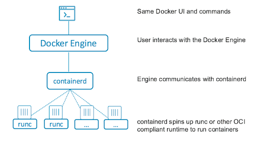

## Deskripsi

Repository untuk belajar docker dalam bahasa Indonesia dengan contoh (_maaf kalau bahasanya berantakan_). Disini akan menjadi playground docker beserta sedikit penjelasan dasar yang harus diketahui.

Kita akan membahas teori ringkas karena yang menjelaskan secara detail panjang dan lebar sudah banyak ditemukan di internet. Kita akan sedikit membahas tentang kenapa harus docker, bagaimana cara memulai, dan hal-hal dasar wajib diketahui.

## Sebelum Mulai

Sebelum mulai pastikan kamu sudah memiliki pengetahuan dasar tentang system operasi, Makefile dan docker. Silahkan belajar di [belajar-os](https://github.com/devetek/belajar-os), [belajar-makefile](https://github.com/devetek/belajar-makefile). Kedua materi tersebut akan membantu kamu mempermudah menguasai materi tentang docker.

Di dalam proses pembuatan materi ini, menggunakan machine dengan spesifikasi berikut:

- MacBook Pro 13-inch, M1, 2020 (Ventura Version 13.1)

- Docker Desktop Version 4.9.1 (81317)

## Bantuan

Seperti yang sudah dijelaskan section _Sebelum Mulai_, untuk mempermudah proses kita dalam mengingat command-command yang digunakan. Disini kita akan menggunakan `Makefile`. Untuk pengguna Windows kamu bisa langsung menggunakan perintah `docker` yang juga akan dijelaskan di bawah:

```sh
 ____       _        _                 ____             _
| __ )  ___| | __ _ (_) __ _ _ __     |  _ \  ___   ___| | _____ _ __
|  _ \ / _ \ |/ _` || |/ _` | '__|____| | | |/ _ \ / __| |/ / _ \ '__|
| |_) |  __/ | (_| || | (_| | | |_____| |_| | (_) | (__|   <  __/ |
|____/ \___|_|\__,_|/ |\__,_|_|       |____/ \___/ \___|_|\_\___|_|
                  |__/

Copyright (c) 2023 Devetek Tech. https://devetek.com.
Repo: https://github.com/devetek/belajar-docker

Use: make <target>

GENERIC
  help                                                Show available commands

DEVELOPMENT
  run                                                 Run playground
```

## Daftar Isi

- Kenapa Docker

- Cara Memulai

- Container Arsitektur

- Configurasi Dasar

- Tentang Registry

- Perintah Dasar

- Docker Compose

### Kenapa Docker

Seperti yang sudah dijelaskan sebelumnya, untuk penjelasan panjang lebar sudah banyak ditemukan di internet. Salah satunya kamu bisa merujuk ke artikel dari AWS [berikut ini](https://aws.amazon.com/id/docker/). Yang paling penting adalah dengan menggunakan Docker, kamu dapat dengan cepat menerapkan dan menjalankan aplikasi ke lingkungan yang identik dimanapun (Windows / MacOS / Linux).

Bayangkan jika kamu diminta untuk membuat aplikasi PHP dengan versi 5.x, kemudian harus melakukan instalasi banyak module PHP dapat membuat aplikasinya berjalan dengan baik. Kemudian project tersebut harus dikerjakan oleh sebuah tim yang dinamis, dengan masing-masing menggunakan sistem operasi yang berbeda-beda (Windows, MacOS, Ubuntu, CentOS, RedHat). Maka hal ini akan membuat proses pengembangan aplikasi berjalan tidak konsisten dan rentan terjadi kesalahan di environment yang berbeda.

### Cara Memulai

Untuk memulai menjalankan repository ini, pastikan kamu sudah melakukan installasi docker di mesin yang kamu gunakan. Untuk melakukan installasi docker silahkan kunjungi link berikut [ini](https://docs.docker.com/engine/install/). Setelah instalasi sukses, seharusnya sekarang kamu memiliki command `docker` di CLI (Command Line Interface).

Selanjutnya kita akan mulai dengan sebuah command simple untuk mencetak `Hello World!` di terminal. Jalankan perintah berikut `make run`. Di dalam perintah tersebut akan melakukan:

1. docker build .

2. docker run -it devetek/belajar-docker:latest bash -c "echo 'Hello World!'"

### Container Arsitektur

Setelah berhasil melakukan instalasi, mari kita menyelam lebih jauh agar lebih dapat memahami tentang docker itu sendiri. Umumnya orang sering mengaitkan docker adalah container, dimana sesungguhnya docker sendiri bukanlah container. Namun adalah sebuah tools untuk memanagement container. Lalu siapa containernya ? yang kamu cari sebenarnya adalah beberapa nama berikut: runc, lxc, containerd, rkt, cri-o, dan sebagainya, mereka disebut dengan container runtimes. Simak diagram di bawah ini yang menjelaskan dimana posisi docker, Source: Docker.



Dari penjelasan diagram di atas, kita akan fokus lebih dalam tentang Docker. Jadi apa tugas docker ? docker sendiri terdiri dari 2 bagian penting. Pertama docker daemon `dockerd` kedua adalah docker CLI. Dimana docker CLI adalah interface untuk developer berkomunikasi dengan docker daemon. Sedangkan docker daemon adalah engine yang melakukan komunikasi dengan container runtimes.

Untuk juga diketahui, berdasarkan standard Open Container Initiative (OCI), ada 2 standard design penting yang harus terpenuhi untuk container dapat berjalan.

1. Image Specification ([image-spec](https://github.com/opencontainers/image-spec))
2. Runtime specification ([runtime-spec](https://github.com/opencontainers/runtime-spec))

Docker akan membantu kita dalam proses pembuatan image-spec dan juga dalam proses komunikasi dengan container runtimes (runtime-spec) sehingga aplikasi kita dapat berjalan dimanapun dan kapanpun.
